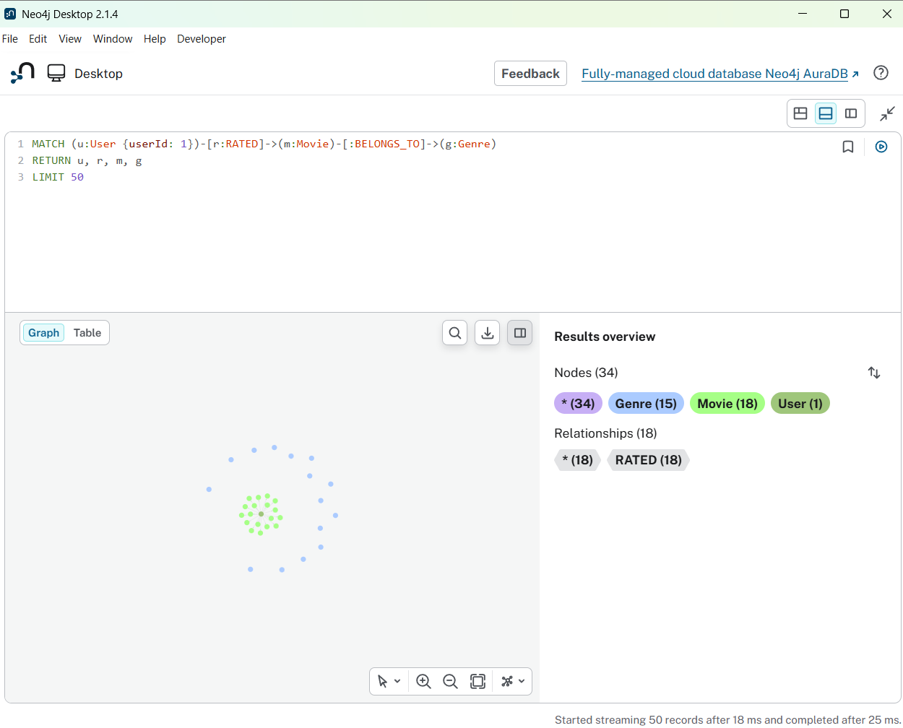
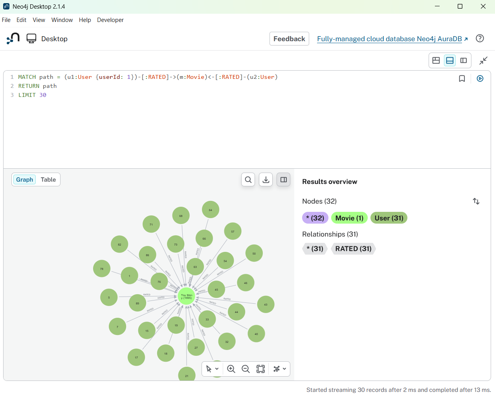
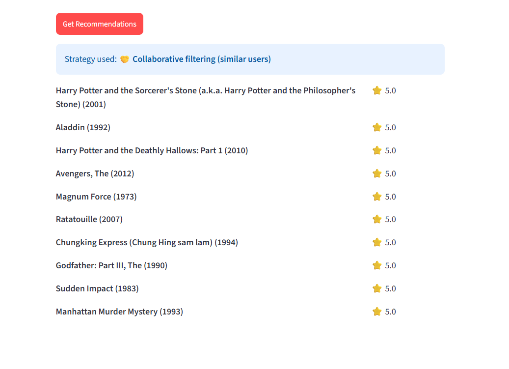

# 🎬 Graph-Based Movie Recommender (Neo4j)

This started as a basic demo with 3 hardcoded users (John/Alice/Bob) and a
similarity query that just counted how many movies two people had in
common. It worked but wasn't really doing anything interesting, so I
rebuilt the core logic and added a real dataset + UI to actually test it.

## What's different now

- Loads the real [MovieLens](https://grouplens.org/datasets/movielens/) small dataset instead of 3 fake users — about 600 users, 9700 movies, 100k ratings
- Similarity between users is now cosine similarity computed on actual rating values, not just a count of shared movies. Two users who rated 3 movies the same way are more alike than two who rated 10 and disagreed on most of them — counting alone couldn't capture that
- New users with little/no rating history get genre + popularity based recommendations instead of nothing (collaborative filtering can't really work for someone with 1 rating)
- Split into separate files (`config.py`, `db.py`, `recommend.py`, `app.py`) instead of one script
- Credentials moved to a `.env` file instead of being hardcoded
- Added a Streamlit UI on top of the old CLI version
- Added some tests for the recommendation logic (mocked DB, so no need for Neo4j to be running to test)

## Data model

```
(User)-[:RATED {rating, timestamp}]->(Movie)-[:BELONGS_TO]->(Genre)
```

## How the recommendation logic works

If a user has rated at least 4 movies, it does collaborative filtering:
finds other users who rated overlapping movies, scores similarity with
cosine similarity, then predicts ratings for unseen movies as a
similarity-weighted average of what similar users gave them.

If a user has fewer than 4 ratings (or CF can't find any decent matches),
it falls back to recommending popular movies within genres the user has
shown interest in — scored with a Bayesian-adjusted average so a movie
with 2 five-star ratings doesn't outrank one with 500 ratings averaging
4 stars.

The actual queries are in `recommend.py`.

## Setup

```bash
git clone https://github.com/Yogi3205/neo4j-movie-recommendation-system.git
cd neo4j-movie-recommendation-system
python -m venv venv
source venv/bin/activate   # venv\Scripts\activate on windows
pip install -r requirements.txt
```

Copy `.env.example` to `.env` and fill in your Neo4j credentials.

In Neo4j Browser, run `queries/schema.cypher` once to set up constraints.

Then load the dataset:
```bash
python data/load_movielens.py
```
Takes a couple minutes.

Run the app:
```bash
streamlit run app.py
```

Or the CLI version:
```bash
python recommend.py
```

Run tests:
```bash
pytest tests/ -v
```

## Demo

**Graph view — one user's rating pattern:**


**Graph view — the similarity traversal, visualized:**


**App — recommendations:**


## Limitations

- Similarity only looks at movies both users rated, not their whole rating history — works fine here but would need the Neo4j GDS library to do properly at larger scale
- No caching of similarity scores, recalculates on every request — would get slow with way more users

## Next steps if I keep working on this

- Try Neo4j's GDS `nodeSimilarity` instead of the hand-rolled cosine similarity
- Wrap it in a small API + Docker so it's actually deployable

## Tech stack

Neo4j, Cypher, Python, Streamlit, pytest

## Author

Yogi K.